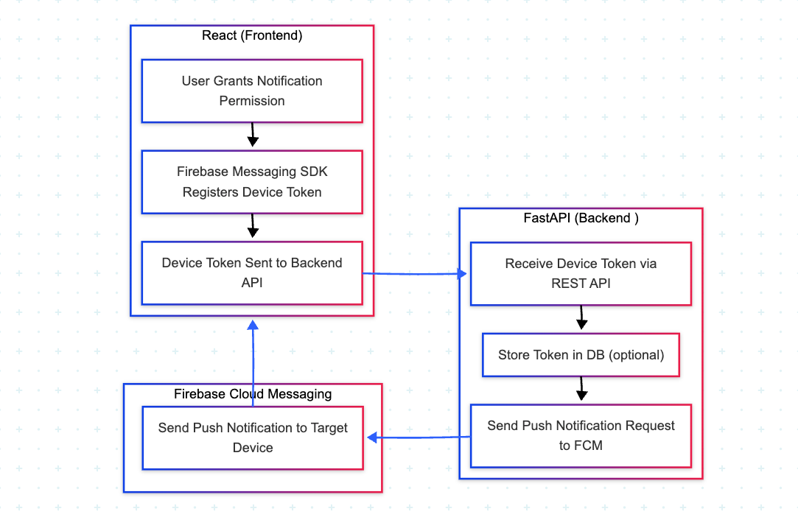

### 🔥 Firebase Push Notification Example 
- Front: React(Typescript + Vite)
- Back: FastAPI

### Process



### Install 
* run `git clone` this repository.

#### Front
- move to `react/`
- run `npm install`
- run `npm run dev`

#### Back
- move to `fastapi/`
- install `poetry`
- move to `app/`
- run `python server.py`

#### Test it
- Test it using command below or FastAPI Swagger.
  ```bash
  curl -X POST http://localhost:8000/push \
    -H "Content-Type: application/json" \
    -d '{
      "title": "안녕하세요!",
      "body": "React 앱으로부터 푸시가 왔어요. 성공! 🎉",
      "token": "YOUR_TOKEN"
  }'
  ```
